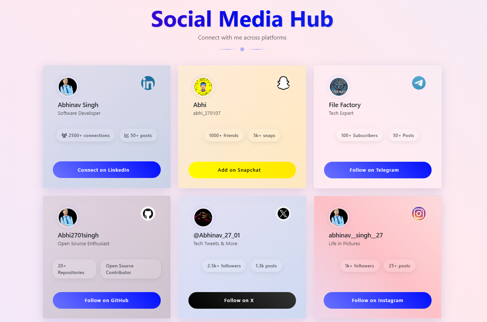

# 🎭 **Social Media Hub** 🌐  

A sleek and interactive social media hub that brings all your profiles together in one stylish space.  

🚀 **Live Demo:** [Social Media Hub](https://socialmediahub07.netlify.app/)  

  

---

## ✨ **Features at a Glance**  

✅ **Glass-morphism UI** – Aesthetic and modern design  
🌗 **Dark/Light Mode** – Switch effortlessly between themes  
🎇 **Interactive Particle Background** – Adds a dynamic touch  
⚡ **Smooth Animations** – Eye-catching transitions and effects  
📱 **Fully Responsive** – Looks great on all devices  
🎨 **Platform-Specific Styling** – Tailored designs for each platform  

---

## 🛠️ **Built With**  

🔹 **HTML5** – Structure & layout  
🔹 **CSS3** – Styling & animations  
🔹 **JavaScript** – Interactivity  
🔹 **Bootstrap 5** – Responsiveness  
🔹 **Font Awesome** – Icon integration  
🔹 **Particles.js** – Dynamic background effects  

---

## 🎯 **Supported Social Platforms**  

🚀 LinkedIn | GitHub | Twitter/X | Instagram | YouTube | Facebook | Snapchat | Telegram | WhatsApp  

---

## 🎨 **Design Highlights**  

✨ **3D Interactive Cards** – Engaging hover effects  
🎭 **Glass-morphism UI** – Futuristic aesthetic  
🎨 **Dynamic Gradients** – Beautiful color transitions  
💫 **Floating Animations** – Subtle yet effective motion  
🚀 **Fast & Optimized** – Lightning-fast loading  

---

## 📱 **Responsive Across Devices**  

💻 **Desktop-Friendly** – Full-width immersive experience  
📱 **Mobile-Optimized** – Perfect for smaller screens  
📊 **Adaptive Layouts** – Adjusts seamlessly to all viewports  

---

## 🔧 **Setup & Installation**  

1️⃣ **Clone the Repository:**  
```bash
git clone https://github.com/yourusername/social-media-hub.git
```
2️⃣ **Open `index.html` in your Browser**  
3️⃣ **Customize Social Links in `index.html`**  

---

## 🛠️ **How to Customize**  

🎯 **Update Social Media Links** – Modify `index.html`  
🎨 **Change Styles** – Edit `styles.css`  
🌌 **Adjust Particle Effects** – Modify `particles-config.json`  
📌 **Add/Remove Social Cards** – Customize as needed  

---

## 🚀 **Future Enhancements**  

🔹 **More Social Platforms** – Expanding the list  
🔹 **Custom Themes** – Personalized user experience  
🔹 **Advanced Animations** – Even smoother transitions  
🔹 **User Profiles** – Personalized social pages  
🔹 **Analytics Integration** – Track engagement & clicks  

---

## 🤝 **Contribute & Support**  

🚀 Found a bug or have an idea? Check out our [issues page](https://github.com/yourusername/social-media-hub/issues).  

🌟 Like this project? Give it a ⭐ on GitHub!  

---

## 👨‍💻 **Author**  

**Abhinav Singh**  
🔗 [LinkedIn](https://www.linkedin.com/in/abhinav-singh-303869294/)  
🐙 [GitHub](https://github.com/Abhi2701singh)  
🎥 [YouTube - CodeNavi](https://youtube.com/@codenavi_07)  

---


